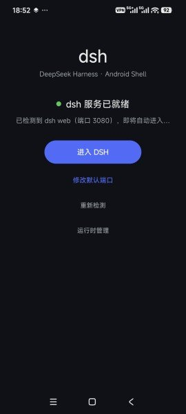
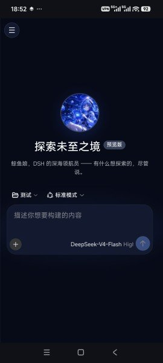
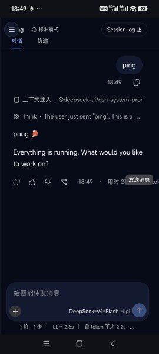

# DSH Android Shell

作者：阿图

这是 DeepSeek Harness 的 Android 外壳：把 DSH 的 Web 界面、Node runtime 和必要的 arm64 原生依赖装进一个 Android App，在手机上直接运行 DSH。

## 截图

### 启动器与服务状态



### DSH 手机主页



### 手机端对话



## 主要特点

- **APK 自带地基**：bootstrap、Node runtime、DSH 核心依赖和 arm64 原生库一并打包，首次启动自动解压到 App 私有目录。
- **升级边界清楚**：后续升级只替换 DSH 自己的 runtime；用户工程、配置、会话、日志和第三方插件放在独立目录，不随 runtime 更新被掀掉。
- **手机 Web 外壳**：通过本地 WebView 访问 App 内的 DSH 服务，保留 DSH 原有的工作区、插件和模型能力。
- **适配小屏操作**：侧边栏支持手势展开/收起，展开时覆盖主界面；发送区避免与其他控制重叠，回车用于换行，不把普通回车误当成发送。
- **Android 存储兼容**：会话持久化在 Android 私有目录中使用同目录原子重命名兜底，避开 Android 对 POSIX hard link 的限制。
- **可诊断**：保留运行状态页、控制台日志和本地服务探测入口，方便排查 runtime、插件和端口问题。

## 工程结构

```text
app/
├─ src/main/java/com/dsh/shell/   # Android bootstrap、服务管理和 WebView 外壳
├─ src/main/assets/                # DSH runtime 与启动脚本
├─ src/main/jniLibs/arm64-v8a/     # dshnode 及其原生依赖
└─ src/main/res/                   # 启动器、图标和界面资源
gradle/                            # Gradle Wrapper
```

运行时目录约定：

```text
App 私有目录/
├─ dsh-runtime/                    # App 自己维护的 runtime
└─ dsh-user/
   ├─ projects/                    # 用户工程
   ├─ config/                      # 配置、会话和插件 profiles
   └─ logs/                        # DSH 日志
```

## 构建

需要 Android SDK、JDK 17+ 和 arm64 Android 设备。Windows 下使用项目自带 Wrapper：

```powershell
$env:GRADLE_USER_HOME = 'C:\GradleAscii'
$env:JAVA_HOME = 'C:\Program Files\Android\Android Studio\jbr'
.\gradlew.bat assembleRelease
```

产物位于 `app/build/outputs/apk/release/app-release.apk`。未提供签名参数时，release 变体会使用 debug keystore，便于直接安装测试；正式发布时请通过 Gradle properties 或环境变量提供自己的签名配置：

```powershell
$env:DSH_RELEASE_KEYSTORE = 'C:\path\to\release.keystore'
$env:DSH_RELEASE_STORE_PASSWORD = '...'
$env:DSH_RELEASE_KEY_ALIAS = '...'
$env:DSH_RELEASE_KEY_PASSWORD = '...'
```

正式签名 keystore 不随仓库分发。

## 当前范围

当前版本面向 arm64 手机，默认把 DSH 服务放在 App 内的 `3080` 端口，并由启动器检测服务后进入 WebView。网络 runtime 更新、插件管理和用户数据都与 APK bootstrap 分开演进。
